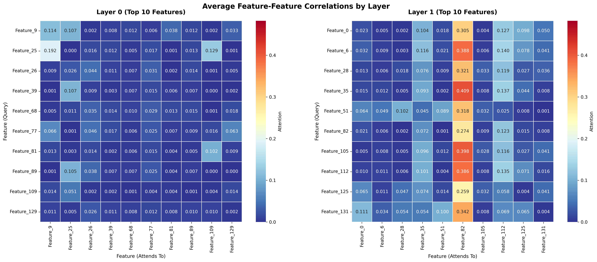
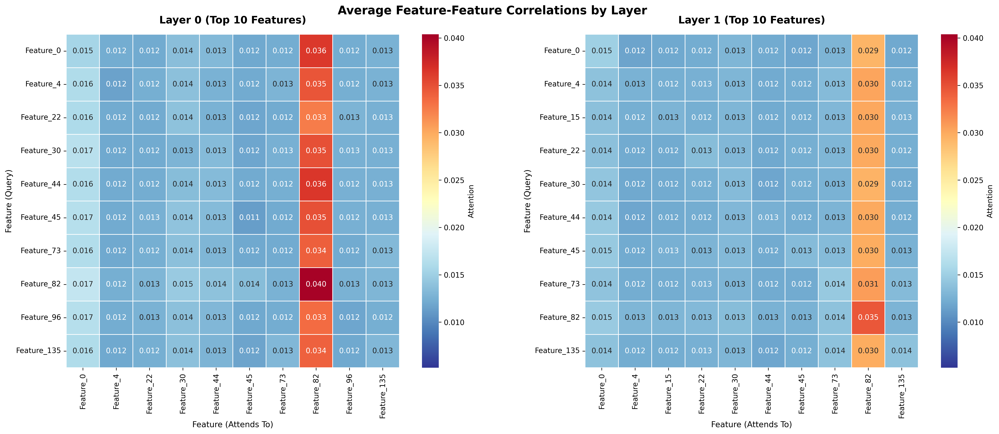
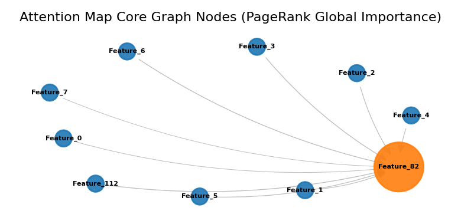

# Correlated Attention Feature-Feature Attention Importance For Multivariate Time-series Analysis

> Treating iTransformer attention maps as weighted directed graphs to discover most informative or attentioned features in multivariate time-series forecasting.

---

## Key Visuals

| Instant snapshot (t = 1) |                   Averaged over 10 000 steps                   |
|:---:|:--------------------------------------------------------------:|
|  |  |

**Core subgraph after PageRank**



*Feature 82 emerges as the dominant hub across every view: raw averages, layer-wise heatmaps, and graph centrality.*

---

## Why iTransformer?

Standard Transformers treat **time-steps as tokens**; [iTransformer](https://github.com/thuml/iTransformer) inverts this and treats **features (sensors/stations) as tokens**. Each feature's entire time-series becomes a single embedding, and self-attention directly encodes *inter-feature* relationships. This makes the attention matrix a natural, interpretable measure of how much each feature relies on every other feature for forecasting — no post-hoc feature-importance proxy needed.

> **Dataset**: available in the [iTransformer repository](https://github.com/thuml/iTransformer) under `dataset/`.

---

## Attention Maps — Structure & Aggregation

The raw output is one `[n_features × n_features]` attention matrix per head per layer. The pipeline:

1. **Average over heads** within each layer → one matrix per layer.  
2. **Keep layers separate** (Layer 0 / Layer 1 heatmaps above) to see how attention patterns evolve with depth.  
3. **Aggregate over time** at two granularities — a single snapshot (t = 1) and the mean over 10 000 steps — to distinguish transient spikes from stable structural dependencies.

### How to read the heatmaps

```
           Feature (Attends To)  →  OUTGOING (row sum = Out-Degree)
           ┌────────────────────┐
Feature  F │  w_00  w_01  ...   │
(Query)  e │  w_10  w_11  ...   │
↕        a │  ...               │
INCOMING t │                    │
(col sum)  └────────────────────┘
```

| Direction | Graph concept | Meaning |
|---|---|---|
| **Row sum** (outgoing) | Out-Degree Centrality | How much this feature *draws from* others |
| **Column sum** (incoming) | In-Degree Centrality | How much this feature *feeds into* others |

A bright **column** → other features attend heavily to this feature; it is an *information provider*.  
A bright **row** → this feature attends heavily to others; it is an *information consumer*.

---

## Attention as a Graph — Evidence for Feature 82

### The equivalence

An attention matrix is a **weighted adjacency matrix** of a fully-connected directed graph:

- Node *i* → Node *j* with weight `A[i,j]`
- Row sum = out-degree; column sum = in-degree

This is the same conceptual bridge exploited by *Attention Rollout / Attention Flow* (Abnar & Zuidema, 2020) and formalised in *Transformers are Graph Neural Networks* (Joshi, 2020).

### What the data shows

The **10 000-step averaged heatmap** (right panel above) shows a single column — **Feature 82** — consistently brighter than all others in both Layer 0 and Layer 1. This means virtually every other feature directs significant attention *toward* Feature 82, regardless of the time-step.

To confirm this is structural and not an artefact of the averaging:

1. **Top-K filtering** — keep only features ranked by total attention weight (in + out). Feature 82 always enters the top set.  
2. **PageRank on the adjacency matrix** — the iterative authority score converges to Feature 82 as the highest-ranked node, matching the raw column-sum result.  
3. **Core subgraph visualisation** — extracting edges above a threshold produces the star topology shown above, with Feature 82 as the sole hub.

The convergence of three independent methods (mean aggregation, PageRank, threshold graph) on the same node is strong evidence that **Feature 82 is a true information hub**: the model has learned that this station's historical values are disproportionately predictive for all other stations.

---

## Motivation & Next Steps

- Transformer-based forecasting models are typically evaluated on predictive accuracy alone, leaving the rich internal representations largely unexplored. This experiment was designed to ask a different question: **can we exploit attention map interpretibility for feature importance identification on the specified model task?**

- A natural next step is to learn attention maps on application dataset (e.g., vehicle dynamics) for a non-predictive task (i.e., anomaly detection) to find the most important features, and feature dependency on capturing such a specified anomaly.

- Additionally, the **CAB (Correlated Attention Block)** layer offers also the possibility to add lagged correlation between the features. This methodology could add value for cause and effect relationships between features (see references)

---

## References

- Abnar & Zuidema (2020) — *Quantifying Attention Flow in Transformers* [`arXiv:2005.00928`](https://arxiv.org/abs/2005.00928)  
- Veličković et al. (2018) — *Graph Attention Networks*
- Liu et al. (2024) — *iTransformer* [`github.com/thuml/iTransformer`](https://github.com/thuml/iTransformer)
- Nguyen Q.M., Nguyen L.M., Das S. (2023) — *Correlated Attention in Transformers for Multivariate Time Series* [`arXiv:2311.11959`](https://arxiv.org/abs/2311.11959)

---

**Author**: Marcello Babbi ([marcello.babbi@gmail.com](mailto:marcello.babbi@gmail.com))  
**License**: MIT  
**Last Updated**: February 2026
