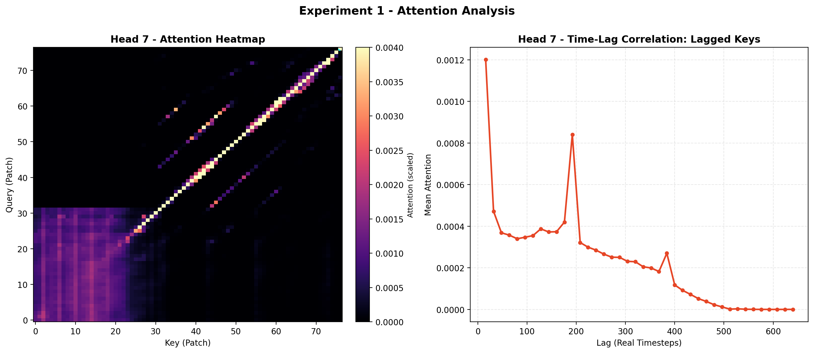
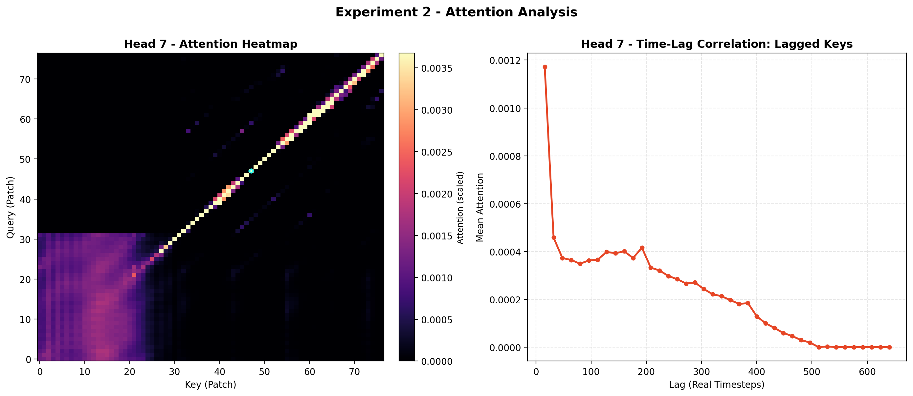

# Multi-Head Attention Maps Visualization for Explainable Temporal Correlation in Time Series Analysis

## Project Overview

- This project demonstrates the **explainable capability** of **Multi-Head Self-Attention layers** by combining their well-known parallelization power while maintaining sequence order through positional encoding and outperforming classical sequential models in time-series forecasting
- The foundation model used is the **Vision Transformer (ViT)**, state-of-the-art in time series prediction models. REF: **[Paper](https://openreview.net/pdf?id=XInsJDBIkp) | [Code](https://github.com/IkeYang/ViTime)**
  - *Model_name*: `ViTime_Model.pth`
  - *Model_weights*: [Google Drive](https://drive.google.com/file/d/1ex5ZrIKhsnLj2EuUkP9We3Bpcr1kVh5d/view?usp=sharing)
- Model hidden architecture has been analyzed to describe the sequence-image-sequence transformations and their tensors' dimensionality
- The **MultiHeadAttentionRollout** class has been implemented:
  - Builds attention maps by extracting attention weights from the transformer's multi-head self-attention mechanism
  - Trasforms 2D spatial token-token attention maps into 1D temporal attention
- **Attention Maps** have been analyzed and visualized to demonstrate how the model identifies **periodicity** and **lagged correlations** in **zero-learning** time series data.

## Key Features

✅ **Attention Weight Extraction** - Hook mechanism captures attention during forward pass  
✅ **Token-to-Time Conversion** - Transforms 2D patch attention → 1D temporal attention  
✅ **Time-Lag Analysis** - Identifies periodic patterns through diagonal correlation  
✅ **Multi-Head Visualization** - Side-by-side heatmap + lag correlation plots

---

## Harmonic Sensitivity Analysis - Which Head is Learning Periodicity?

The experiment goal is demonstrating which head is modeling the harmonics. 
All experiments use **512-sample synthetic signals** and analyze **Head 7**, chosen after multi-head analysis. 

### Experiment 1: Three Harmonics

**Input**: `sin(n/10) + sin(n/5 + 50) + cos(n + 50)`



**Findings**:
- Lag-attention peaks at **≈63, 3x63, 6x63 samples** (multiples of first harmonic fundamental period)
- 🔍 Hypothesis: Head 7 models harmonic 1 (fundamental period ≈63)

### Experiment 2: Removing the Fundamental — Proof of Periodicity Detection

**Input**: `sin(n/5 + 50) + cos(n + 50)` *(removed `sin(n/10)`)*



**Findings**:
- ❌ Peaks at ~63 samples **disappeared**
- Only shorter-period structures remain (31-sample and 6-sample components)
- ✅ **Confirms Head 7 was modeling first harmonic** — Peaks directly correspond to true signal periodicity

---

## Key Insights

- 🔬 **Explainable Temporal Dependencies**: Attention maps reveal *which* historical patterns causally influence predictions — transforming black-box forecasting into interpretable reasoning
- 🎯 **Zero-Shot Pattern Discovery**: Pre-trained model identifies temporal structures in completely unseen signals without task-specific training
- ⏰ **Multi-Scale Temporal Modeling**: Single architecture simultaneously captures short-term transients and long-term periodic dependencies across different time horizons
- 🔍 **Explainable AI**: Attention weights provide transparent evidence of learned relationships that **domain experts** can validate, verify, and trust
## Next Steps
- 🌐 **Multi-Sensor Temporal Modeling**: develop cross-channel attention analysis to visualize how sensor A's history influences sensor B's predictions
- 🏭 **Domain-Specific Adaptation**: Fine-tune on vehicle telemetry (powertrain, thermal, suspension dynamics) for predictive maintenance
- 🔍 Extend to a non-predictive task: Exploit big data and temporal correlations to find interpretable insights on anomaly detection system
---

## Implementation Overview

### File Structure
```
.
├── main.py                              # Experiment orchestration
├── config.py                            # Model weights path
├── model/
│   ├── attention_rollout.py             # Base attention extraction class
│   └── multi_head_attention_rollout.py  # Visualization & analysis
└── experiments/
    └── attention_maps/                  # Generated plots
```

### Core Architecture

#### 1. **AttentionRollout** (Base Class)
- Registers forward hooks on attention layers
- Captures attention weights: `(Batch, Heads, Sequence, Sequence)`
- Converts token-token → time-time attention

#### 2. **MultiHeadAttentionRollout** (Analysis Class)
Extends base with:
- Time-lag correlation computation
- Attention map extraction per head
- Statistical summaries across heads

#### 3. **MultiHeadAttentionRolloutPlotter** (Visualization Class)
Generates combined plots:
- **Left subplot**: Attention heatmap (patch × patch)
- **Right subplot**: Time-lag correlation (real timesteps)
- **Filename**: `experiment_{N}_head_{H}_correlations.png`

---

## Critical Implementation Details

### 🔓 Fused Attention Deactivation

**Essential for hook registration to work:**
```python
for name, module in model.named_modules():
    if name.endswith('attn') and isinstance(module, Attention):
        module.fused_attn = False  # CRITICAL
```

**Why?** Fused attention bypasses the standard forward pass, preventing hooks from capturing outputs.

---

### 🔄 Token → Time Attention Conversion

The model uses a **2D grid** (`grid_h × grid_w`) to process 1D time series:

1. Remove CLS token (if present)
2. Reshape: `(Npatch, Npatch)` → `(grid_h, grid_w, grid_h, grid_w)`
3. Average over height: `A_time = mean(A, axis=(0, 2))`
4. Result: **Time-time attention** `(grid_w, grid_w)`

**Scaling**: Each patch = 16 samples → `real_lag = patch_lag × 16`

---

### 📊 Time-Lag Correlation

Extracts attention along sub-diagonals (queries attending to earlier keys):
```python
for lag in range(1, max_lag):
    diagonal = np.diag(A_time, k=-lag)  # Causal direction
    mean_attention[lag] = diagonal.mean()
```

**Reveals**: Which time lags the model focuses on for prediction

---

## Usage Example
```python
from model.multi_head_attention_rollout import MultiHeadAttentionRolloutPlotter
from tools import ViTimePrediction

# Initialize model
model = ViTimePrediction(device='cuda:0', model_name='MAE')

# Initialize visualizer
plotter = MultiHeadAttentionRolloutPlotter(model)

# Create signal
signal = np.sin(np.arange(512) / 10) + np.cos(np.arange(512) / 5)

# Generate visualizations
plotter.plot_attention_heads(
    input_tensor=signal,
    prediction_horizon=720,
    heads_to_plot=[7, 11],
    experiment='custom_experiment',
    powermap=True,
    gamma=1.0
)
```
---

## Quick Start
```bash
# Clone repository
git clone https://github.com/Mascele11/coding-examples.git
cd coding-examples/multi-head-attention-correlation-maps-example

# Run experiments
python main.py
```

**Output**: Generates combined visualization plots in `experiments/attention_maps/`

---

**Output**: `experiments/attention_maps/experiment_custom_experiment_head_7_correlations.png`

---

## Dependencies
```python
torch>=1.9.0
numpy>=1.19.0
matplotlib>=3.3.0
timm>=0.4.12  # Vision Transformer models
```

**Hardware**: CUDA-capable GPU recommended

---

## Troubleshooting

| Issue | Solution |
|-------|----------|
| No attention captured | Verify `fused_attn = False` before hooks |
| Wrong attention shape | Check `drop_cls="auto"` handles CLS token |
| Blank plots | Ensure `plt.close(fig)` after each save |
| Mixed visualizations | Use separate figures per head |


## References

- **ViTime Paper**: [Multi-Resolution Time-Series Transformer](https://openreview.net/pdf?id=XInsJDBIkp)
- **Original Code**: [IkeYang/ViTime](https://github.com/IkeYang/ViTime)

---

**Author**: Marcello Babbi ([marcello.babbi@gmail.com](mailto:marcello.babbi@gmail.com))  
**License**: MIT  
**Last Updated**: February 2026