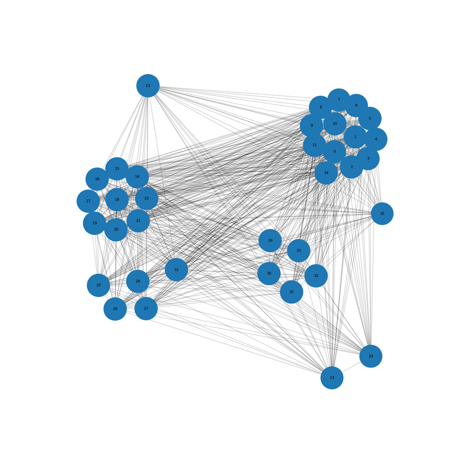

## Temporal Attention GNN Forecasting Example

This project, [temporal-attention-graph-network-example](https://github.com/Mascele11/coding-examples/tree/main/temporal-attention-graph-network-example), implements a **TAGN** (Temporal Attention Graph Network) model, which can be found in `model/pytorch.py`. 

The repository focuses on modeling the temporal and spatial dynamics of the **ERCOT (Electric Reliability Council of Texas) power grid**. The TAGN model is designed to capture complex dependencies across the grid's topology over time, making it suitable for forecasting or anomaly detection in energy infrastructure.

###  Graph Visualization

The following image represents the topology of a power grid as processed by the model:

### Key Observations:
* **Power Hub Clusters**: The graph highlights clear clusters of nodes that function as **power hubs**. These hubs are critical points in the grid where multiple transmission lines converge, representing major distribution and generation centers.
* **Drawing Method**: The visualization is generated using the **`kamada_kawai_layout`** (found within the `get_graph` function in `main.py`). This specific force-directed algorithm was chosen to emphasize the community structure of the grid, naturally separating the various power hubs to make the network's hierarchy and connectivity intuitive.

#### Setup

- Be sure you are in the correct directory, otherwise `cd src/sampleapplication/`
- Make sure you have python 3.X or greater (check it using `python -V`)
- Then create the virtual environment. It should be specific for this project and placed inside its directory (so to be cleaned together with the repo)
    - venv: `python3.X -m venv ./venv-package/`
    - conda: `conda create --prefix ./conda-package/ python=3.7`
- Activate your virtual environment
    - venv:
        - UNIX `source venv-package/bin/activate`
        - WS `venv-package\Scripts\activate`
    - conda:
        - UNIX `conda activate ./conda-package/`
        - WS `conda activate .\conda-package\ `
- Install python dependencies `pip install -r requirements`